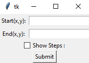
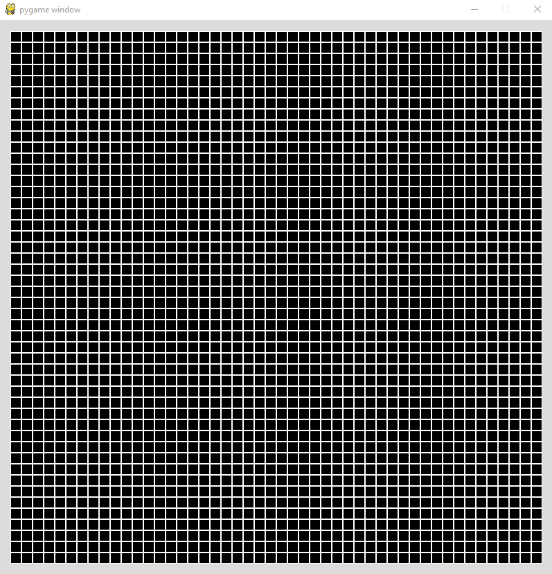
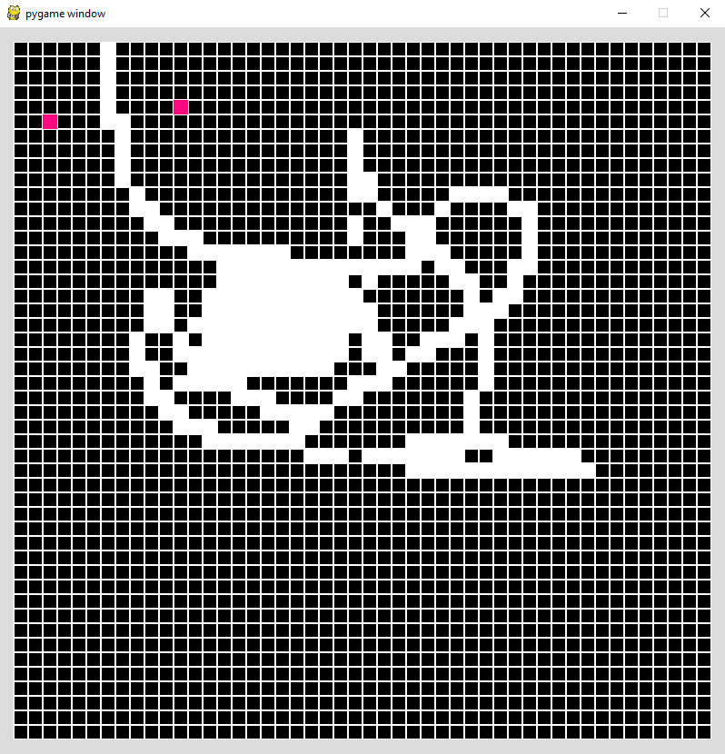
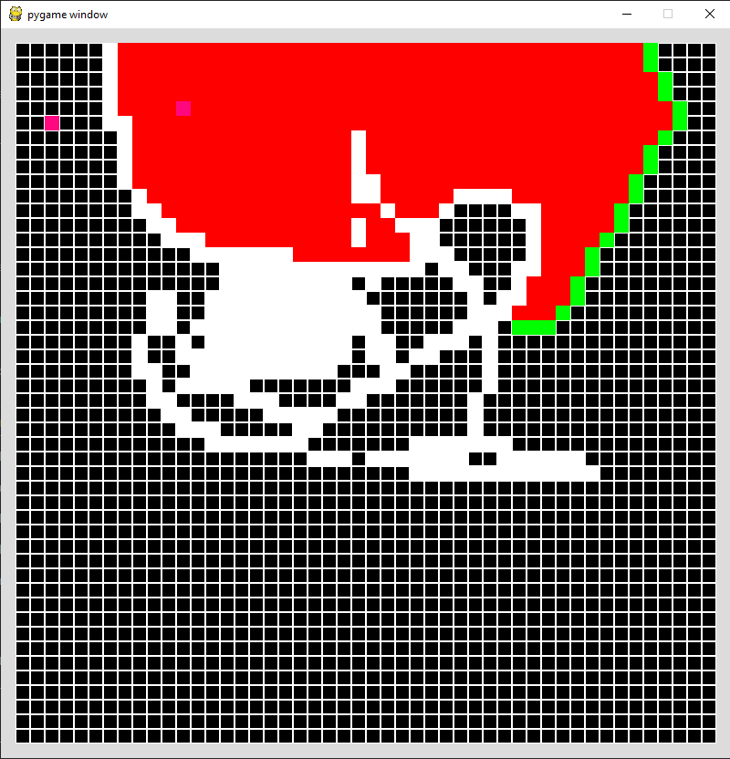
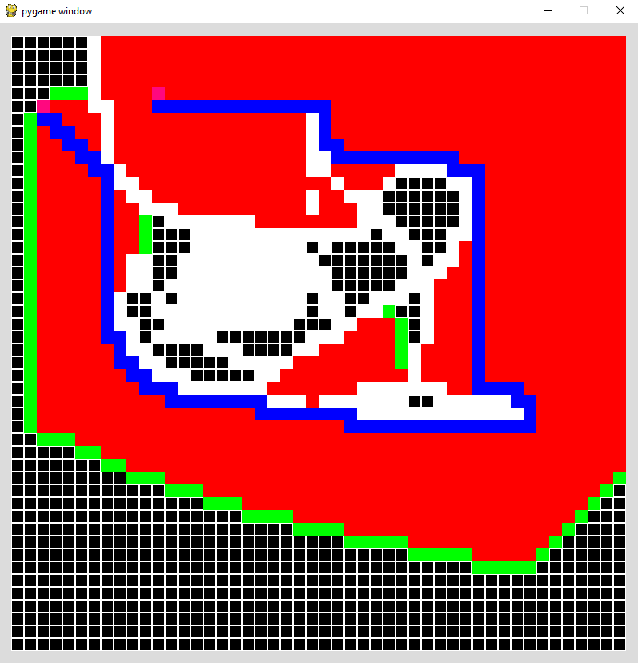
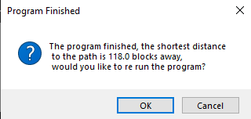

# Path Finder
An A* path finding program that visualizes the shortest path between two plotted points submitted by the user, and any obstacles or interferences the user decides to input. Program features python's drawing capabilities, which makes it simple to create an obstacle.

## Starting menu
The user inputs 2 points and if they would like to see the algorithm in action (showing the steps the program takes in order to recieve the outcome).

## Game Board
This is the board the program will be running in, and the graph where the points will be plotted. (the GUI for the program)

## Defining the obstacles 
This is an example of two random points being plotted on the game board, with a sample obstacle drawn (it can be anything, as the game board acts as a canvas when drawing the obstacles).

## Algorithm in action
This is an example of the A* algorithm in action, trying to find the most effecient path to connect both the end points, taking advantage of the graphical user interface.
The algorithm used in this program is A*, which is commonly used in python to find the closest route between two end points. It is the most effective and efficient python compatible algorithm I know (as of my Sophomore year in High School), so I decided to write the program around this algorithm.

## Final Path
This is an example of the completed path, which is the shortest route the program has calculated.

## Calculations
Here is an example of the message that is delivered to the user after the program is finished running.

# Dependencies Used
* Python
* Tkinker
* Pygame
